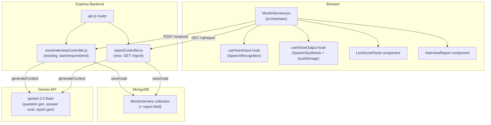
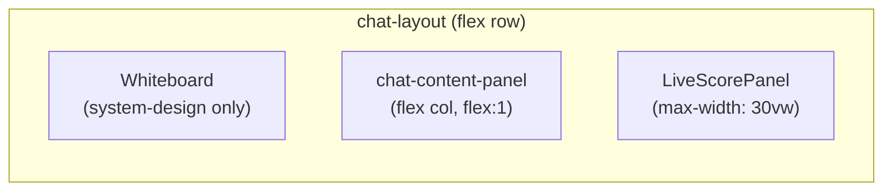

# Design Document: AI Mock Interview Depth

## Overview

This design enhances the existing AI Mock Interview module with three depth layers:

1. **Voice I/O** — browser-native Speech Recognition (input) and Speech Synthesis (output) wrapped in custom React hooks, giving candidates a hands-free, conversational interview experience.
2. **Live Score Panel** — a sidebar component that updates in real time after each answer, showing per-answer scores, a running average, and correctness indicators.
3. **Detailed Post-Interview Report** — a new backend endpoint that calls Gemini to produce a structured report (overall score, per-question breakdown, topic performance, weak areas, study recommendations) and persists it to MongoDB.

The feature is entirely additive: no existing API contracts are broken. The `MockInterview` Mongoose schema gains one new top-level field (`report`). The `respondToInterview` controller gains a minor normalization fix to guarantee a consistent `Answer_Feedback` shape. A new `GET /api/mock-interview/:id/report` endpoint is added. On the frontend, two custom hooks (`useVoiceInput`, `useVoiceOutput`) and two new components (`LiveScorePanel`, `InterviewReport`) are introduced, and `MockInterview.jsx` is refactored to wire them together.

---

## Architecture



---

## Components and Interfaces

### 1. `useVoiceInput` Hook

**File:** `frontend/src/hooks/useVoiceInput.js`

**Responsibilities:**
- Wraps `window.SpeechRecognition` / `window.webkitSpeechRecognition`
- Manages `isListening`, `error`, `isSupported` state
- Appends final transcripts to a caller-supplied setter without overwriting existing text
- Displays interim results in a separate `interimTranscript` state
- Handles `onerror` (including `not-allowed`, `no-speech`, `network`, `audio-capture`) and auto-stops after 10 s of silence

**Interface:**
```js
const {
  isListening,      // boolean
  isSupported,      // boolean — false hides the mic button
  error,            // string | null — inline error message
  interimTranscript,// string — live partial result
  startListening,   // () => void
  stopListening,    // () => void
  toggleListening,  // () => void
} = useVoiceInput({ onFinalTranscript: (text) => void });
```

**Key implementation notes:**
- `continuous: false`, `interimResults: true`, `lang: 'en-US'`
- `onresult`: if `isFinal`, call `onFinalTranscript(transcript)` and clear `interimTranscript`; otherwise set `interimTranscript`
- `onend`: set `isListening = false`, clear `interimTranscript`
- `onerror`: set `error` to a human-readable message, set `isListening = false`
- 10-second silence timer: `setTimeout` started on `startListening`, cleared on any `onresult` or `onend`; fires `stopListening()` if still active
- `onFinalTranscript` callback in `MockInterview.jsx`: `setInputText(prev => (prev.trimEnd() ? prev.trimEnd() + ' ' : '') + transcript)`

---

### 2. `useVoiceOutput` Hook

**File:** `frontend/src/hooks/useVoiceOutput.js`

**Responsibilities:**
- Wraps `window.speechSynthesis`
- Reads/writes `mockInterview_voiceEnabled` in `localStorage`
- Strips markdown and emoji before speaking
- Cancels any in-progress utterance before starting a new one
- Exposes `speak(text)`, `cancel()`, `voiceEnabled`, `setVoiceEnabled`, `isSupported`

**Interface:**
```js
const {
  voiceEnabled,     // boolean
  setVoiceEnabled,  // (boolean) => void — also writes localStorage
  isSupported,      // boolean — false hides the toggle button
  speak,            // (text: string) => void
  cancel,           // () => void
} = useVoiceOutput();
```

**Key implementation notes:**
- `isSupported = 'speechSynthesis' in window`
- Initialization: read `localStorage.getItem('mockInterview_voiceEnabled')`; if `=== 'false'` → `false`; otherwise (including absent/unrecognized) → `true`
- `setVoiceEnabled(val)`: update state, attempt `localStorage.setItem('mockInterview_voiceEnabled', String(val))` in a try/catch (silent failure per Req 6.2)
- `speak(text)`: if `!voiceEnabled || !isSupported` return; call `window.speechSynthesis.cancel()`; create `SpeechSynthesisUtterance(cleanText)` with `lang = 'en-US'`; attach `onerror` handler that logs and does not retry; call `window.speechSynthesis.speak(utterance)`
- `cleanText`: `text.replace(/[*_`~]/g, '').replace(/[\u{1F000}-\u{1FAFF}\u{2600}-\u{27BF}]/gu, '')`
- Cleanup on unmount: `window.speechSynthesis.cancel()`

---

### 3. `LiveScorePanel` Component

**File:** `frontend/src/components/LiveScorePanel.jsx`

**Responsibilities:**
- Displays a vertical list of per-answer score entries
- Shows a running average at the top
- Shows answered count ("X/5 answered")
- Shows a pending indicator for the in-flight answer
- Color-codes each score: green (7–10), yellow (4–6), red (0–3)
- Shows an ✗ icon for `isCorrect: false` entries

**Props:**
```ts
interface LiveScorePanelProps {
  scores: Array<{
    score: number;       // 0–10
    isCorrect: boolean;
  }>;
  totalQuestions: number; // always 5
  isPending: boolean;     // true while waiting for backend response
}
```

**Layout constraint:** max-width 30% of viewport on ≥768px; positioned as a fixed sidebar to the right of the chat messages column. On <768px it collapses to a compact horizontal strip above the input area.

**Color helper (pure function, exported for testing):**
```js
export function scoreColor(score) {
  if (score >= 7) return 'green';
  if (score >= 4) return 'yellow';
  return 'red';
}
```

**Running average helper (pure function, exported for testing):**
```js
export function runningAverage(scores) {
  if (scores.length === 0) return null;
  const sum = scores.reduce((acc, s) => acc + s.score, 0);
  return Math.round((sum / scores.length) * 10) / 10;
}
```

---

### 4. `InterviewReport` Component

**File:** `frontend/src/components/InterviewReport.jsx`

**Responsibilities:**
- Renders the Post_Interview_Report in the review phase
- Five named sections (rendered as `<section>` elements with `data-section` attributes for testability):
  1. **Overall Performance** — score gauge, recommendation badge, summary paragraph
  2. **Question Breakdown** — accordion list of Q&A pairs with per-answer scores, correctness, correct answer (if wrong), strengths, improvements
  3. **Topic Performance** — horizontal bar chart (Recharts `BarChart`) of topic average scores
  4. **Weak Areas** — list of weak topics with average score and study recommendations; shows "No significant weak areas identified. Focus on maintaining your strengths." when empty
  5. **Recommendations** — consolidated study action items
- "Start New Interview" button at the bottom

**Props:**
```ts
interface InterviewReportProps {
  report: PostInterviewReport; // see Data Models
  onStartNew: () => void;
}
```

---

### 5. Changes to `MockInterview.jsx`

**Phase state machine** remains `setup | chat | review`. Changes:

- Replace inline `isListening`/`voiceEnabled` state + `recognitionRef` with `useVoiceInput` and `useVoiceOutput` hooks
- Add `scores` state: `Array<{ score: number; isCorrect: boolean }>` — populated from `data.feedback` on each `handleSend` response
- Add `isPending` state: set `true` before `api.post('/mock-interview/respond')`, set `false` after
- Add `report` state: fetched from `GET /api/mock-interview/:id/report` when `data.status === 'completed'`
- Render `<LiveScorePanel>` alongside the chat messages column during `phase === 'chat'`
- Render `<InterviewReport>` instead of the existing `overall-feedback-card` div during `phase === 'review'`
- Wire `useVoiceInput`'s `onFinalTranscript` to append to `inputText`
- Wire `useVoiceOutput`'s `speak()` to AI messages
- Show mic button only when `useVoiceInput.isSupported`; show voice toggle only when `useVoiceOutput.isSupported`
- Show `useVoiceInput.error` and `useVoiceInput.interimTranscript` inline below the textarea

**Chat layout with LiveScorePanel:**


---

## Data Models

### MockInterview Schema — `report` field addition

Add a new top-level `report` subdocument to `mockInterviewSchema`. The existing `overallFeedback` field is preserved unchanged for backward compatibility.

```js
// backend/models/MockInterview.js — additions

const weakAreaSchema = new mongoose.Schema({
  topic:           { type: String, required: true },
  averageScore:    { type: Number, min: 0, max: 10 },
  recommendations: [String],  // 1–3 items
}, { _id: false });

const topicPerformanceSchema = new mongoose.Schema({
  topic:        { type: String, required: true },
  averageScore: { type: Number, min: 0, max: 10 },
  questionCount:{ type: Number },
}, { _id: false });

const perQuestionSchema = new mongoose.Schema({
  questionText:  { type: String },
  answerText:    { type: String },
  score:         { type: Number, min: 0, max: 10 },
  isCorrect:     { type: Boolean },
  correctAnswer: { type: String },   // only when isCorrect === false
  strengths:     [String],           // 1–3 items
  improvements:  [String],           // 1–3 items
}, { _id: false });

// Added to mockInterviewSchema:
report: {
  totalScore:          { type: Number, min: 0, max: 100 },
  recommendation:      { type: String },
  summary:             { type: String },
  perQuestionBreakdown:[perQuestionSchema],
  topicPerformance:    [topicPerformanceSchema],
  weakAreas:           [weakAreaSchema],
  generatedAt:         { type: Date },
}
```

### `messageSchema` — `feedback` field normalization

The existing `feedback` subdocument is missing `isCorrect` and `correctAnswer`. Add them:

```js
feedback: {
  score:         { type: Number, min: 0, max: 10 },
  isCorrect:     { type: Boolean },
  correctAnswer: { type: String },   // only populated when isCorrect === false
  strengths:     [String],
  improvements:  [String],
},
```

### TypeScript-style interface for `PostInterviewReport` (frontend)

```ts
interface WeakArea {
  topic: string;
  averageScore: number;
  recommendations: string[];  // 1–3
}

interface TopicPerformance {
  topic: string;
  averageScore: number;
  questionCount: number;
}

interface PerQuestionEntry {
  questionText: string;
  answerText: string;
  score: number;           // 0–10
  isCorrect: boolean;
  correctAnswer?: string;
  strengths: string[];     // 1–3
  improvements: string[];  // 1–3
}

interface PostInterviewReport {
  totalScore: number;                    // 0–100
  recommendation: 'Strong Hire' | 'Hire' | 'Lean Hire' | 'No Hire' | 'Strong No Hire';
  summary: string;                       // 2–4 sentences
  perQuestionBreakdown: PerQuestionEntry[];
  topicPerformance: TopicPerformance[];
  weakAreas: WeakArea[];
  generatedAt: string;                   // ISO date string
}
```

---

## API Contracts

### Existing endpoints — changes

#### `POST /api/mock-interview/respond`

No change to request shape. Response shape gains guaranteed `feedback` field structure:

```jsonc
// Response (unchanged fields omitted)
{
  "interviewId": "...",
  "message": "...",
  "feedback": {           // always present when status is active or completing
    "score": 7,           // 0–10
    "isCorrect": true,
    "correctAnswer": null, // string only when isCorrect === false
    "strengths": ["..."],
    "improvements": ["..."]
  },
  "status": "active" | "completed",
  "questionsAsked": 3,
  "overallFeedback": null  // or object when status === "completed"
}
```

**Controller change:** In `respondToInterview`, after parsing `feedbackForAnswer` from Gemini JSON, normalize the shape before assigning to `lastUserMsg.feedback`:

```js
if (feedbackForAnswer) {
  lastUserMsg.feedback = {
    score:         feedbackForAnswer.score         ?? 0,
    isCorrect:     feedbackForAnswer.isCorrect     ?? null,
    correctAnswer: feedbackForAnswer.isCorrect === false
                     ? (feedbackForAnswer.correctAnswer ?? '')
                     : undefined,
    strengths:     Array.isArray(feedbackForAnswer.strengths)    ? feedbackForAnswer.strengths    : [],
    improvements:  Array.isArray(feedbackForAnswer.improvements) ? feedbackForAnswer.improvements : [],
  };
}
```

---

### New endpoint: `GET /api/mock-interview/:id/report`

**Auth:** `auth` middleware (JWT)  
**File:** `backend/controllers/reportController.js`  
**Route registration:** `router.get('/mock-interview/:id/report', auth, getInterviewReport);`

#### Request
```
GET /api/mock-interview/6849abc123/report
Authorization: Bearer <token>
```

#### Success Response `200`
```jsonc
{
  "report": {
    "totalScore": 72,
    "recommendation": "Lean Hire",
    "summary": "The candidate demonstrated solid understanding of...",
    "perQuestionBreakdown": [
      {
        "questionText": "Explain the difference between BFS and DFS...",
        "answerText": "BFS uses a queue...",
        "score": 8,
        "isCorrect": true,
        "strengths": ["Clear explanation", "Correct complexity analysis"],
        "improvements": ["Could mention use cases more explicitly"]
      }
    ],
    "topicPerformance": [
      { "topic": "Graph Algorithms", "averageScore": 7.5, "questionCount": 2 }
    ],
    "weakAreas": [
      {
        "topic": "Dynamic Programming",
        "averageScore": 4.0,
        "recommendations": [
          "Practice Leetcode DP problems (medium difficulty)",
          "Study memoization vs tabulation trade-offs",
          "Review classic problems: Knapsack, LCS, Coin Change"
        ]
      }
    ],
    "generatedAt": "2025-01-15T10:30:00.000Z"
  }
}
```

#### Error Responses
| Status | Condition |
|--------|-----------|
| `404` | Interview not found or does not belong to requesting user |
| `400` | Interview is not yet completed (`status !== 'completed'`) |
| `503` | Both Gemini and fallback generation failed |

#### Controller Logic (`getInterviewReport`)

```
1. Find interview by :id + userId (ownership check)
2. If not found → 404
3. If status !== 'completed' → 400
4. If interview.report already exists → return cached report (200)
5. Try Gemini report generation:
   a. Build prompt from interview.messages (Q&A pairs + existing feedback)
   b. Call model.generateContent(prompt)
   c. Parse JSON from response (wrapped in ```json fences)
   d. Validate required fields; fill defaults for missing optional fields
   e. Assign to interview.report, set interview.report.generatedAt = new Date()
   f. await interview.save()
   g. Return 200 with report
6. On Gemini failure → try fallback generation:
   a. Build report from interview.messages[].feedback data already in DB
   b. Derive topics using simple keyword extraction (no external call)
   c. Assign to interview.report, save, return 200
7. On fallback failure → return 503
```

#### Gemini Prompt Template for Report Generation

```
You are evaluating a completed ${interviewType} interview at ${company} for the role of ${role}.

Here is the full interview transcript with per-answer scores:
${formattedTranscript}

Generate a comprehensive post-interview report as a JSON object (wrapped in ```json fences) with this exact structure:
{
  "totalScore": <number 0-100>,
  "recommendation": <"Strong Hire"|"Hire"|"Lean Hire"|"No Hire"|"Strong No Hire">,
  "summary": <string, 2-4 sentences>,
  "perQuestionBreakdown": [
    {
      "questionText": <string>,
      "answerText": <string>,
      "score": <number 0-10>,
      "isCorrect": <boolean>,
      "correctAnswer": <string or null>,
      "strengths": [<1-3 strings>],
      "improvements": [<1-3 strings>]
    }
  ],
  "topicPerformance": [
    { "topic": <string>, "averageScore": <number>, "questionCount": <number> }
  ],
  "weakAreas": [
    {
      "topic": <string>,
      "averageScore": <number>,
      "recommendations": [<1-3 strings>]
    }
  ]
}

Rules:
- weakAreas must only include topics where averageScore < 6
- topicPerformance must cover all questions grouped by concept
- recommendations must be specific and actionable (e.g., "Practice Leetcode DP problems", not "Study more")
- If no weak areas exist, return weakAreas as an empty array []
```

#### Fallback Report Generation (no Gemini)

When Gemini is unavailable, the fallback builds the report entirely from `interview.messages[].feedback`:

```js
function buildFallbackReport(interview) {
  const qaPairs = extractQAPairs(interview.messages); // pairs of {question, answer, feedback}

  const perQuestionBreakdown = qaPairs.map(({ question, answer, feedback }) => ({
    questionText:  question,
    answerText:    answer,
    score:         feedback?.score         ?? 0,
    isCorrect:     feedback?.isCorrect     ?? null,
    correctAnswer: feedback?.correctAnswer ?? null,
    strengths:     feedback?.strengths     ?? [],
    improvements:  feedback?.improvements  ?? [],
  }));

  // Topic grouping: assign "General" as topic (no Gemini for labels)
  const topicPerformance = [{
    topic: 'General',
    averageScore: average(perQuestionBreakdown.map(q => q.score)) * 10, // scale 0-10 → 0-100
    questionCount: perQuestionBreakdown.length,
  }];

  const weakAreas = perQuestionBreakdown
    .filter(q => q.score < 6)
    .length > 0
    ? [{ topic: 'General', averageScore: average(perQuestionBreakdown.filter(q => q.score < 6).map(q => q.score)), recommendations: ['Review incorrect answers above', 'Practice similar questions', 'Revisit core concepts for this interview type'] }]
    : [];

  const totalScore = Math.round(average(perQuestionBreakdown.map(q => q.score)) * 10);
  // ... recommendation from totalScore thresholds (same as generateFallbackFeedback)

  return { totalScore, recommendation, summary, perQuestionBreakdown, topicPerformance, weakAreas, generatedAt: new Date() };
}
```

---

## localStorage Persistence

| Key | Type | Default | Notes |
|-----|------|---------|-------|
| `mockInterview_voiceEnabled` | `"true"` \| `"false"` | `"true"` (absent = enabled) | Written on every toggle; read on hook init |

The microphone active state (`isListening`) is **never** persisted. It always initializes to `false`.

Read logic in `useVoiceOutput`:
```js
const stored = localStorage.getItem('mockInterview_voiceEnabled');
const initial = stored === 'false' ? false : true; // absent or unrecognized → true
```

Write logic:
```js
const setVoiceEnabled = (val) => {
  _setVoiceEnabled(val);
  try { localStorage.setItem('mockInterview_voiceEnabled', String(val)); }
  catch (_) { /* silent — continue with in-session preference only */ }
};
```

---

## Correctness Properties

*A property is a characteristic or behavior that should hold true across all valid executions of a system — essentially, a formal statement about what the system should do. Properties serve as the bridge between human-readable specifications and machine-verifiable correctness guarantees.*

---

### Property 1: Transcript Append Correctness

*For any* existing input text value (including empty string) and any final transcript string produced by Speech Recognition, the resulting input text should equal the trimmed existing text followed by a single space and the transcript — or just the transcript if the existing text was empty/whitespace-only.

Formally: `result === (existing.trimEnd() ? existing.trimEnd() + ' ' : '') + transcript`

**Validates: Requirements 1.2**

---

### Property 2: Final Transcript Immutability

*For any* sequence of Speech Recognition events containing one or more final transcripts followed by one or more interim transcripts, the committed portion of the input text (the text appended from final transcripts) should remain unchanged after any interim result is received.

**Validates: Requirements 1.8**

---

### Property 3: Error Event Stops Capture

*For any* error event type string emitted by the Speech Recognition API (including `'not-allowed'`, `'no-speech'`, `'network'`, `'audio-capture'`, or any other string), after the error fires: `isListening` should be `false` and `error` should be a non-empty string.

**Validates: Requirements 1.9**

---

### Property 4: Voice Output Cancel-Then-Speak with Cleaned Text

*For any* AI message string with `voiceEnabled = true` and Speech Synthesis available, calling `speak(text)` should: (a) call `window.speechSynthesis.cancel()` before `window.speechSynthesis.speak()`, and (b) pass a cleaned string to `SpeechSynthesisUtterance` that contains none of the characters `*`, `_`, `` ` ``, `~`, or any Unicode codepoint in U+1F000–U+1FAFF or U+2600–U+27BF.

**Validates: Requirements 2.1, 2.2, 2.5**

---

### Property 5: No Speak When Voice Output Disabled

*For any* AI message string received while `voiceEnabled = false`, `window.speechSynthesis.speak()` should NOT be called.

**Validates: Requirements 2.4**

---

### Property 6: Markdown and Emoji Stripping

*For any* input string, the `cleanText` function should return a string that contains none of the characters `*`, `_`, `` ` ``, `~`, and no Unicode codepoints in the ranges U+1F000–U+1FAFF or U+2600–U+27BF. Non-markdown, non-emoji characters should be preserved unchanged.

**Validates: Requirements 2.5**

---

### Property 7: Running Average Correctness

*For any* non-empty array of `Answer_Feedback` objects with scores in [0, 10], the `runningAverage` function should return a value equal to `Math.round((sum / count) * 10) / 10` — i.e., the arithmetic mean rounded to one decimal place.

**Validates: Requirements 3.3**

---

### Property 8: Score Color Classification

*For any* integer score in [0, 10], the `scoreColor` function should return `'green'` for scores 7–10, `'yellow'` for scores 4–6, and `'red'` for scores 0–3.

**Validates: Requirements 3.4**

---

### Property 9: Answer Count Increment

*For any* sequence of N `Answer_Feedback` objects received during a session, the answered count displayed by `LiveScorePanel` should equal N.

**Validates: Requirements 3.5**

---

### Property 10: Incorrect Answer Indicator

*For any* `Answer_Feedback` object with `isCorrect = false`, the rendered `LiveScorePanel` entry for that answer should contain the incorrect indicator element; for any entry with `isCorrect = true`, the incorrect indicator should be absent.

**Validates: Requirements 3.7**

---

### Property 11: Report Structural Completeness

*For any* completed `MockInterview` document, the generated `PostInterviewReport` should satisfy all of: `totalScore` ∈ [0, 100]; `recommendation` ∈ `{'Strong Hire', 'Hire', 'Lean Hire', 'No Hire', 'Strong No Hire'}`; `summary` is a non-empty string; `perQuestionBreakdown` has one entry per user answer, each with non-empty `strengths` (≥1) and `improvements` (≥1) arrays.

**Validates: Requirements 4.2, 4.3**

---

### Property 12: Weak Area Identification

*For any* set of `Answer_Feedback` objects, the `weakAreas` array in the generated report should contain exactly those topics whose average score is strictly less than 6, each with between 1 and 3 recommendations. No topic with average score ≥ 6 should appear in `weakAreas`.

**Validates: Requirements 4.4, 5.1, 5.2**

---

### Property 13: Topic Average Correctness

*For any* grouping of questions by topic label, the `averageScore` for each topic in `topicPerformance` should equal the arithmetic mean of the scores of all questions assigned to that topic, rounded to one decimal place.

**Validates: Requirements 4.5**

---

### Property 14: Fallback Report Validity

*For any* `MockInterview` document with at least one user message containing `feedback` data, the fallback report generator (invoked when Gemini is unavailable) should produce a `PostInterviewReport` that satisfies the same structural completeness invariant as Property 11 — without throwing an error or returning null.

**Validates: Requirements 4.8**

---

### Property 15: Weak Areas Message Correctness

*For any* `PostInterviewReport`, the Weak Areas section should display the message "No significant weak areas identified. Focus on maintaining your strengths." if and only if `weakAreas` is an empty array. When `weakAreas` is non-empty, that message should not appear.

**Validates: Requirements 5.3, 5.4**

---

### Property 16: Weak Areas Sort Order

*For any* list of `WeakArea` objects, the `InterviewReport` component should render them in ascending order of `averageScore`; for entries with equal `averageScore`, they should be sorted alphabetically by `topic` label (case-insensitive).

**Validates: Requirements 5.7**

---

### Property 17: localStorage Voice Preference Persistence

*For any* boolean value `v` passed to `setVoiceEnabled(v)`, after the call, `localStorage.getItem('mockInterview_voiceEnabled')` should equal `String(v)` (i.e., `'true'` or `'false'`), provided localStorage is available.

**Validates: Requirements 6.1**

---

### Property 18: localStorage Initialization

*For any* string value stored in `localStorage` under `mockInterview_voiceEnabled`, the `useVoiceOutput` hook should initialize `voiceEnabled` to `true` if the stored value is `'true'` or any non-`'false'` string (including absent key), and to `false` only when the stored value is exactly `'false'`.

**Validates: Requirements 6.3, 6.4**

---

## Error Handling

### Voice Input Errors

| Error Type | User-Visible Message | System Action |
|------------|---------------------|---------------|
| `not-allowed` | "Microphone access denied. Please allow microphone access in your browser settings." | `isListening = false`, disable mic button until page reload |
| `no-speech` | "No speech detected. Please try again." | `isListening = false`, mic button re-enabled |
| `network` | "Network error during voice capture. Please check your connection." | `isListening = false`, mic button re-enabled |
| `audio-capture` | "Audio capture failed. Please check your microphone." | `isListening = false`, mic button re-enabled |
| 10s silence timeout | "No speech detected for 10 seconds. Microphone stopped." | `isListening = false`, mic button re-enabled |
| API not supported | (mic button hidden, tooltip shown) | `isSupported = false` |

### Voice Output Errors

| Condition | Handling |
|-----------|----------|
| `SpeechSynthesisErrorEvent` during utterance | `console.error(event.error)`, no retry, no user-visible message |
| `speechSynthesis` not in window | `isSupported = false`, toggle button hidden |

### Report Generation Errors

| Condition | HTTP Status | Response |
|-----------|-------------|----------|
| Interview not found / wrong user | 404 | `{ message: 'Interview not found' }` |
| Interview not completed | 400 | `{ message: 'Interview is not yet completed' }` |
| Gemini fails, fallback succeeds | 200 | Full report (from fallback) |
| Both Gemini and fallback fail | 503 | `{ message: 'Report generation temporarily unavailable. Please try again later.' }` |
| Gemini JSON parse error | — | Fall through to fallback silently |

### Answer Feedback Normalization

If Gemini returns a `feedbackForAnswer` object missing any field, the normalization step in `respondToInterview` fills defaults:
- `score` → `0`
- `isCorrect` → `null`
- `correctAnswer` → `undefined` (omitted from DB)
- `strengths` → `[]`
- `improvements` → `[]`

This prevents the frontend from crashing on `undefined` property access.

---

## Testing Strategy

### Unit Tests (example-based)

**`useVoiceInput`:**
- Mic button click starts recognition (`start()` called, `isListening = true`)
- Mic button click while active stops recognition (`stop()` called, `isListening = false`)
- `not-allowed` error disables mic button
- API not supported → `isSupported = false`
- `onend` event → `isListening = false` within 200ms

**`useVoiceOutput`:**
- Toggle off → `cancel()` called
- `speechSynthesis` absent → `isSupported = false`
- Utterance `lang` is `'en-US'`
- `onerror` → no retry

**`LiveScorePanel`:**
- Renders "0/5 answered" on mount
- Shows pending indicator when `isPending = true`
- Renders correct answer indicator for `isCorrect = false` entries

**`InterviewReport`:**
- All 5 section headings present when given a complete report
- "Start New Interview" button present
- "No significant weak areas" message shown when `weakAreas = []`
- "No significant weak areas" message absent when `weakAreas` is non-empty

**`reportController`:**
- Returns 404 for unknown interview
- Returns 400 for active (non-completed) interview
- Returns cached report if `interview.report` already set
- Returns 503 when both Gemini and fallback throw

### Property-Based Tests

Use **fast-check** (JavaScript PBT library) for all property tests. Each test runs a minimum of **100 iterations**.

Tag format: `// Feature: ai-mock-interview-depth, Property N: <property_text>`

| Property | Test File | Generator |
|----------|-----------|-----------|
| P1: Transcript append | `useVoiceInput.test.js` | `fc.tuple(fc.string(), fc.string())` |
| P2: Final transcript immutability | `useVoiceInput.test.js` | `fc.array(fc.string())` for finals + `fc.array(fc.string())` for interims |
| P3: Error event stops capture | `useVoiceInput.test.js` | `fc.string()` for error type |
| P4: Cancel-then-speak with cleaned text | `useVoiceOutput.test.js` | `fc.string()` for message |
| P5: No speak when disabled | `useVoiceOutput.test.js` | `fc.string()` for message |
| P6: Markdown/emoji stripping | `useVoiceOutput.test.js` | `fc.string()` with arbitrary Unicode |
| P7: Running average | `LiveScorePanel.test.js` | `fc.array(fc.integer({min:0,max:10}), {minLength:1})` |
| P8: Score color | `LiveScorePanel.test.js` | `fc.integer({min:0,max:10})` |
| P9: Answer count | `LiveScorePanel.test.js` | `fc.array(fc.record({score:fc.integer({min:0,max:10}),isCorrect:fc.boolean()}))` |
| P10: Incorrect indicator | `LiveScorePanel.test.js` | `fc.record({score:fc.integer({min:0,max:10}),isCorrect:fc.boolean()})` |
| P11: Report structure | `reportController.test.js` | `fc.record(...)` for MockInterview shape |
| P12: Weak area identification | `reportController.test.js` | `fc.array(fc.record({score:fc.integer({min:0,max:10}),topic:fc.string()}))` |
| P13: Topic average | `reportController.test.js` | `fc.array(fc.record({topic:fc.string(),score:fc.integer({min:0,max:10})}))` |
| P14: Fallback report validity | `reportController.test.js` | `fc.record(...)` for MockInterview with feedback |
| P15: Weak areas message | `InterviewReport.test.js` | `fc.array(fc.record({topic:fc.string(),averageScore:fc.float({min:0,max:10})}))` |
| P16: Weak areas sort order | `InterviewReport.test.js` | `fc.array(fc.record({topic:fc.string(),averageScore:fc.float({min:0,max:10})}))` |
| P17: localStorage persistence | `useVoiceOutput.test.js` | `fc.boolean()` |
| P18: localStorage initialization | `useVoiceOutput.test.js` | `fc.string()` for stored value |

### Integration Tests

- `GET /api/mock-interview/:id/report` returns a valid report for a completed interview (real MongoDB, mocked Gemini)
- Report is persisted to DB and returned on second call without re-calling Gemini
- `POST /api/mock-interview/respond` returns normalized `feedback` shape on every response

### Test Setup

Install fast-check in the frontend dev dependencies:
```bash
npm install --save-dev fast-check vitest @testing-library/react @testing-library/user-event
```

Backend tests use **Jest** (already available via Node ecosystem) with `fast-check` for property tests:
```bash
npm install --save-dev fast-check jest
```
